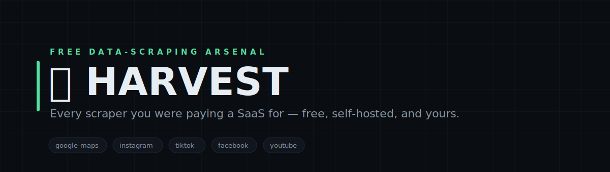
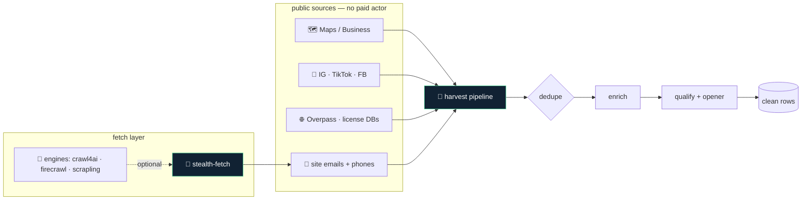

<!-- Apify Replacement — white-label. No personal or company identifiers in this file by design. -->

<p align="center">
  
</p>

<h1 align="center">🌾 Apify Replacement</h1>

<p align="center">
  <b>Every scraper you were paying a SaaS for — free, self-hosted, and yours.</b><br>
  <sub>A drop-in replacement for paid scraping actors: Google Maps, Instagram, TikTok, Facebook, YouTube, open web/lead data, government license databases, and a built-in <b>stealth fetcher</b> — using public endpoints, embedded JSON, and open-data APIs. Plug in <b>crawl4ai / Firecrawl / Scrapling</b> when you want more muscle. No per-run billing, no vendor lock-in.</sub>
</p>

<p align="center">

= 18">


</p>

<p align="center">
<code>google-maps</code> · <code>instagram</code> · <code>tiktok</code> · <code>facebook</code> · <code>youtube</code> · <code>open-data</code> · <code>license-dbs</code> · <code>stealth</code> · <code>$0 to run</code>
</p>

---

## Why Apify Replacement

Paid scraping platforms meter you per run and lock your pipeline behind an API you don't control. Apify Replacement is the same capability, self-hosted: each scraper pulls from a public endpoint, embedded page JSON, or an open-data REST API — so it costs nothing to run and never disappears behind a pricing change. Bring a headless browser and you're done.

---

## What it does

| Module | What it does | Signal |
|---|---|---|
| **maps + business** | Google Maps / Business listings via headless DOM — name, rating, reviews, phone, site | no API key |
| **social** | Instagram, TikTok, Facebook public profiles & posts via embedded page JSON | no paid actor |
| **youtube** | Video comments + transcript pulls for research and lead signals | public data |
| **open data** | Overpass (OpenStreetMap) by bbox + category, and US state license databases (Socrata/CSV) | unlimited / keyless |
| **stealth fetch** | One `stealthFetch()` call — real-browser stealth render, graceful HTTP fallback, UA rotation | anti-detection |
| **engines** | Drive **crawl4ai / Firecrawl / Scrapling** through one contract when you want more muscle | bring-your-own |
| **web content + emails** | Crawl a site's contact pages; decode obfuscated (Cloudflare/entity/`[at]`) emails + phones | robots-aware |
| **enrichment + pipeline** | Dedupe → enrich → qualify → personalized-opener over the scraped rows | end-to-end |

---

## Architecture



---

## Quickstart

```bash
# 1. install (headless browser + parsers)
npm install

# 2. scrape local businesses from Google Maps — no key needed
node scrapers/google-maps-scraper.cjs "coffee shops in Austin" --limit 25

# 3. free open-data lead pulls — no key, no metering
node scrapers/open-data/osm-overpass.cjs --bbox=30.10,-97.94,30.52,-97.56 appointment-services   # any city, by bounding box
node scrapers/open-data/socrata-licenses.cjs WA --limit 25 --trade electrical                     # US state license DB

# 4. turn a name+website lead into an emailable contact ($0)
node scrapers/site-emails.cjs example-biz.com

# 5. fetch any page while dodging bot detection (real browser if installed, else HTTP)
node lib/stealth-fetch.cjs https://example.com --render

# 6. see which power engines are installed, then use one
node engines/index.cjs --list
node engines/index.cjs firecrawl https://example.com

# 7. run the full pipeline: scrape → dedupe → enrich → qualify
node pipeline/qualified-leads.cjs --help
```

> Everything runs locally and keyless. Optional add-ons: a residential-proxy for high-volume social scraping, and any of **crawl4ai / Firecrawl / Scrapling** for the [engines](engines/) layer — each is auto-detected and never required.

---

## Repository layout

```
harvest/
├── scrapers/
│   ├── *.cjs           ← one file per source (maps, ig, tiktok, fb, yt, web, business)
│   ├── site-emails.cjs ← crawl a site's contact pages → decoded emails + phones
│   └── open-data/      ← keyless open data: osm-overpass (bbox+category), socrata-licenses (state DBs)
├── engines/            ← bring-your-own crawler: crawl4ai · firecrawl · scrapling (one contract)
├── clipper/            ← YouTube transcript + clip helpers
├── enrichment/         ← dedupe + enrich scraped rows
├── pipeline/           ← qualified-leads + personalized-opener end-to-end
├── lib/                ← shared headless-browser session, stealth-fetch, email-extract
├── examples/           ← hashtag research, competitor monitoring
└── docs/               ← source-by-source mapping + notes
```

---

## Design principles

1. **Free sources only.** Every scraper uses a public endpoint, embedded JSON, or open-data API — no paid actor, no per-run bill.
2. **Polite by default.** Rate limits, robots.txt, retries with backoff — scrape like a good citizen.
3. **Portable.** No hardcoded geography or accounts; point it at any query, region, or bounding box.
4. **Composable.** Each scraper stands alone or feeds the dedupe → enrich → qualify pipeline.
5. **Bring-your-own engine.** A $0 stealth fetcher works out of the box; plug in crawl4ai / Firecrawl / Scrapling through one contract when you want more — auto-detected, never required.

---

<p align="center"><sub>Apify Replacement · free scrapers · no metering · self-hosted · MIT</sub></p>
