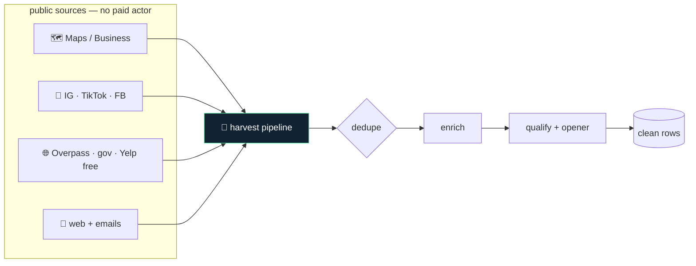

<!-- HARVEST — white-label. No personal or company identifiers in this file by design. -->

<p align="center">
  
</p>

<h1 align="center">🌾 HARVEST</h1>

<p align="center">
  <b>Every scraper you were paying a SaaS for — free, self-hosted, and yours.</b><br>
  <sub>A drop-in replacement for paid scraping actors: Google Maps, Instagram, TikTok, Facebook, YouTube, and open web/lead data — using public endpoints, embedded JSON, and open data APIs. No per-run billing, no vendor lock-in.</sub>
</p>

<p align="center">

= 18">

</p>

<p align="center">
<code>google-maps</code> · <code>instagram</code> · <code>tiktok</code> · <code>facebook</code> · <code>youtube</code> · <code>open-data</code> · <code>$0 to run</code>
</p>

---

## Why HARVEST

Paid scraping platforms meter you per run and lock your pipeline behind an API you don't control. HARVEST is the same capability, self-hosted: each scraper pulls from a public endpoint, embedded page JSON, or an open-data REST API — so it costs nothing to run and never disappears behind a pricing change. Bring a headless browser and you're done.

---

## What it does

| Module | What it does | Signal |
|---|---|---|
| **maps + business** | Google Maps / Business listings via headless DOM — name, rating, reviews, phone, site | no API key |
| **social** | Instagram, TikTok, Facebook public profiles & posts via embedded page JSON | no paid actor |
| **youtube** | Video comments + transcript pulls for research and lead signals | public data |
| **open data** | Overpass (OpenStreetMap), gov open-data (ArcGIS / Socrata), Yelp free tier | unlimited / free tier |
| **web content** | Generic page + contact-email extraction with robots.txt respect and retries | polite by default |
| **enrichment + pipeline** | Dedupe → enrich → qualify → personalized-opener over the scraped rows | end-to-end |

---

## Architecture



---

## Quickstart

```bash
# 1. install (headless browser + parsers)
npm install

# 2. scrape local businesses from Google Maps — no key needed
node scrapers/google-maps-scraper.cjs "coffee shops in Austin" --limit 25

# 3. run the full pipeline: scrape → dedupe → enrich → qualify
node pipeline/qualified-leads.cjs --help
```

> Everything runs locally. The only optional key is a residential-proxy provider for high-volume social scraping — every other source is public.

---

## Repository layout

```
harvest/
├── scrapers/       ← one file per source (maps, ig, tiktok, fb, yt, web, business)
├── clipper/        ← YouTube transcript + clip helpers
├── enrichment/     ← dedupe + enrich scraped rows
├── pipeline/       ← qualified-leads + personalized-opener end-to-end
├── lib/            ← shared headless-browser session
├── examples/       ← hashtag research, competitor monitoring
└── docs/           ← source-by-source mapping + notes
```

---

## Design principles

1. **Free sources only.** Every scraper uses a public endpoint, embedded JSON, or open-data API — no paid actor, no per-run bill.
2. **Polite by default.** Rate limits, robots.txt, retries with backoff — scrape like a good citizen.
3. **Portable.** No hardcoded geography or accounts; point it at any query, any region.
4. **Composable.** Each scraper stands alone or feeds the dedupe → enrich → qualify pipeline.

---

<p align="center"><sub>HARVEST · free scrapers · no metering · self-hosted · MIT</sub></p>
