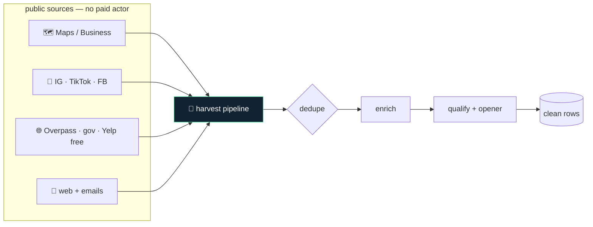

# HARVEST — Architecture

A drop-in replacement for paid scraping actors: Google Maps, Instagram, TikTok, Facebook, YouTube, and open web/lead data — using public endpoints, embedded JSON, and open data APIs. No per-run billing, no vendor lock-in.

## Flow

## How it fits together

Each file in `scrapers/` is a standalone module exporting a `scrape()` function. They share one headless-browser session (`lib/`) and never depend on each other, so you can run one in isolation or chain them through the `pipeline/`. The pipeline is a straight line: scrape → dedupe → enrich → qualify → personalized-opener — each stage reads the previous stage's rows and writes clean output.

## Extending it

Every capability is a self-contained module. To add your own, follow the contract the existing
modules use and wire it into the entry point. Keep it portable — config via `.env`, no hardcoded
paths, no personal accounts.

## Design principles

1. **Free sources only.** Every scraper uses a public endpoint, embedded JSON, or open-data API — no paid actor, no per-run bill.
2. **Polite by default.** Rate limits, robots.txt, retries with backoff — scrape like a good citizen.
3. **Portable.** No hardcoded geography or accounts; point it at any query, any region.
4. **Composable.** Each scraper stands alone or feeds the dedupe → enrich → qualify pipeline.
